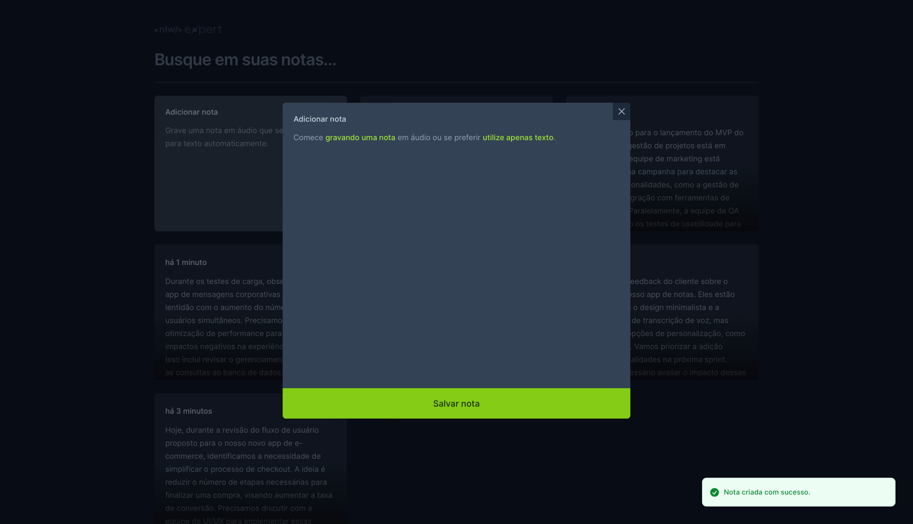

# NLW EXPERT NOTES

#### Idiomas:
#### [PT-BR](#pt-br) || [US-EN](#us-en)

# PT-BR
Consiste num app minimalista para criar e gerenciar notas. Com suporte para entrada de texto e áudio, os usuários podem facilmente adicionar novas notas falando, além de digitá-las. O reconhecimento de fala é feito através da `SpeechRecognition API` disponível em navegadores modernos, tornando a adição de notas rápida e eficiente.

## Características

- **Interface Minimalista**: Focada na usabilidade e na estética limpa.
- **Suporte a Texto e Áudio**: Adicione notas digitando ou falando.
- **Transcrição Automática**: O texto é transcrito em tempo real quando as notas são adicionadas via áudio.
- **Tecnologias Modernas**: Construído com React (Vite), Tailwind CSS, date-fns, Radix UI, Sonner, TypeScript e a API SpeechRecognition.


[live app link](nlw-expert-notes.web.app)

## Como Funciona

O usuário pode iniciar a adição de uma nova nota selecionando o modo de entrada (texto ou áudio). No modo áudio, conforme o usuário fala, suas palavras são transcritas em tempo real e salvas como uma nota. Cada nota pode ser editada ou excluída posteriormente.

## Pré-requisitos

Antes de iniciar, certifique-se de ter instalado em sua máquina:
- Node.js (versão recomendada ou superior)
- NPM ou Yarn

## Configuração Local

Para configurar este projeto localmente, siga estas etapas:

1. Clone o repositório:
```bash
git clone https://github.com/victorpowilleit/nlw-expert-notes.git
```
2. Navegue até a pasta do repositório:
```bash
cd nlw-expert-notes
```
3. Instale as dependências:
```bash
npm install
```

## Como Contribuir

Contribuições são sempre bem-vindas!
Seja adicionando novas funcionalidades, corrigindo bugs ou melhorando a documentação.

Para contribuir:
- Faça um **fork** do projeto.
- Crie uma **nova branch** para sua contribuição 
- Envie para a branch `git push origin feature/nova-funcionalidade`.
- Abra um **Pull Request**.

Feito por [Victor Powilleit](https://github.com/victorpowilleit) no evento NLW.

# US-EN
This app is a minimalist tool for creating and managing notes. With support for both text and audio input, users can easily add new notes by speaking, in addition to typing them. Speech recognition is performed through the `SpeechRecognition API` available in modern browsers, making note addition quick and efficient.


## Features

- **Minimalist Interface:** Focused on usability and clean aesthetics.
- **Text and Audio Support:** Add notes by typing or speaking.
- **Automatic Transcription:** Text is transcribed in real-time as notes are added via audio.
- **Modern Technologies:** Built with React (Vite), Tailwind CSS, date-fns, Radix UI, Sonner, TypeScript, and the SpeechRecognition API.
 

[live app link](nlw-expert-notes.web.app)

## How It Works

Users can start adding a new note by selecting the input mode (text or audio). In audio mode, as the user speaks, their words are transcribed in real-time and saved as a note. Each note can later be edited or deleted.

## Prerequisites

Before starting, make sure you have installed on your machine:

- Node.js (recommended version or higher)
- NPM or Yarn

## Local Setup

To set up this project locally, follow these steps:

1. lone the repository:
```bash
git clone https://github.com/victorpowilleit/nlw-expert-notes.git
```
2. Navigate to the repository folder:
```bash
cd nlw-expert-notes
```
3. Install the dependencies:
```bash
npm install
```
## How to Contribute

Contributions are always welcome!
Whether adding new features, fixing bugs, or improving documentation.

To contribute:

- Make a **fork** of the project.
- Create a **new branch** for your contribution.
- Push to the branch `git push origin feature/new-feature`.
- Open a **Pull Request**.

Created by [Victor Powilleit](https://github.com/victorpowilleit) at the NLW event.
